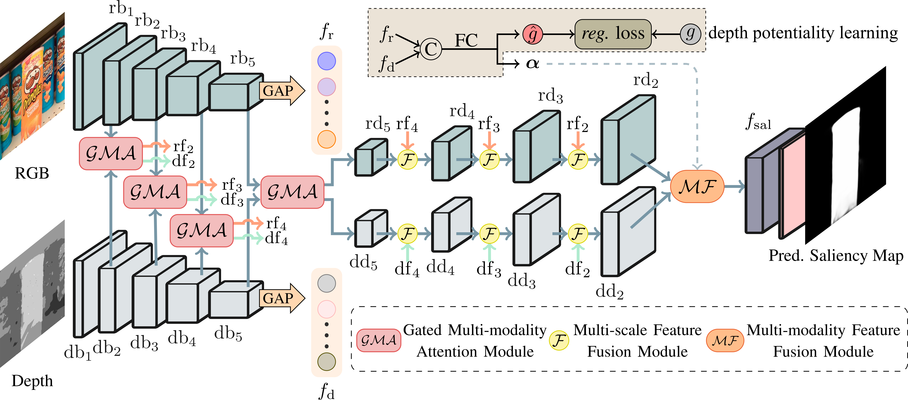
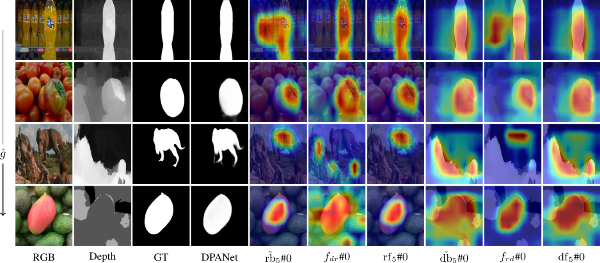

# Depth Potentiality-Aware Gated Attention Network for RGB-D Salient Object Detection

This repo. is an official implementation of the *DPANet* , which has been accepted in the *IEEE Trans. Image Processing, 2020*. 

The main pipeline is shown as the following, 


And some visualization results are listed 




## Dependencies 
```
>= Pytorch 1.0.0
OpenCV-Python
[optional] matlab
```

## Preparation 
- download the official pretrained model of ResNet-50/ResNet-34/ResNet-18 implemented in Pytorch if you want to train the network again.
- download or put the RGB-D saliency benchmark datasets ([Google drive](https://drive.google.com/file/d/19pvXom9vs7cS4L1y-bZI8YDtSg7r4LT0/view?usp=sharing)) in the folder of `data` for training or test.
- [optional] generate the pseudo label (provided for `NJUD` and `NLPR`) using the scripts `gen.m` and `cal_score.py`.

## Training
```
python3 train.py --tag res50 --save_path res50_res
```
make sure  that the GPU memory is enough (the original training is conducted on 8 NVIDIA RTX2080Ti cards with the batch size of 32).

## Test
```
 python3 test.py --tag res50 --gpu 0 --model res50_res/model-30
```

[TODO] We provide the trained model file ([Google drive]()), and run this command to check its integrity:
```
md5sum model-res50-30.pt 
```
you will obtain the result ` `.

The saliency maps are also available ([Google drive](https://drive.google.com/file/d/1sIqEKDCi_rSY4t1THPlBSyAd05F2ve_Q/view?usp=sharing)). 

## Evaluation
We provide the evaluation code in the folder  "eval_code" for fair comparisons. You may need to revise the `algorithms` , `data_root`, and `maps_root` defined in the `main.m`. The saliency maps of the competitors (official maps or obtained by running the official code) are provided ([Google drive](https://drive.google.com/drive/folders/1G3XCOnQTQA-QrSWt6VwJXU1jbAQJS3Hy?usp=sharing)).

## Citation
Please cite the `DPANet` in your publications if it helps your research:
```
@article{chen2020depth,
  title={Depth Potentiality-Aware Gated Attention Network for RGB-D Salient Object Detection},
  author={Chen, Zuyao and Cong, Runmin and Xu, Qianqian and Huang, Qingming},
  journal={IEEE Trans. Image Process},
  year={2020}
}
```
